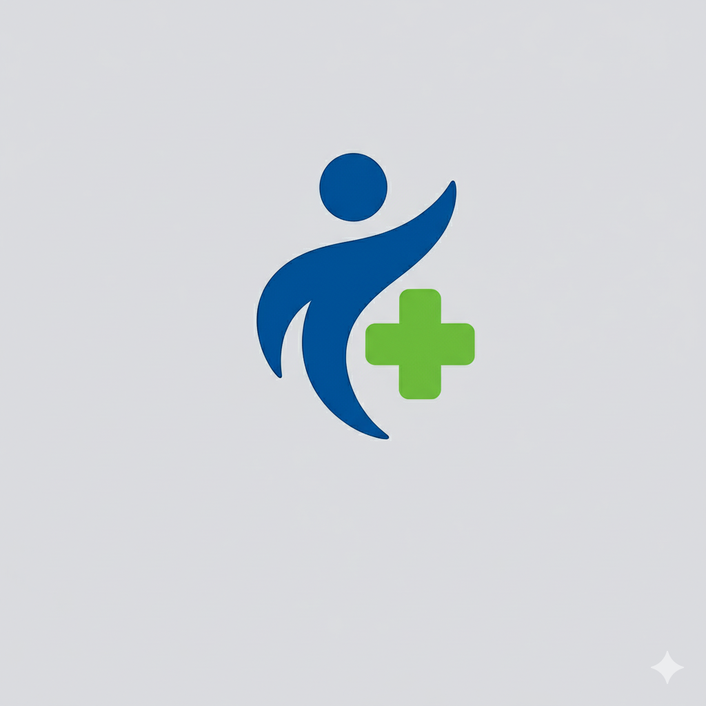
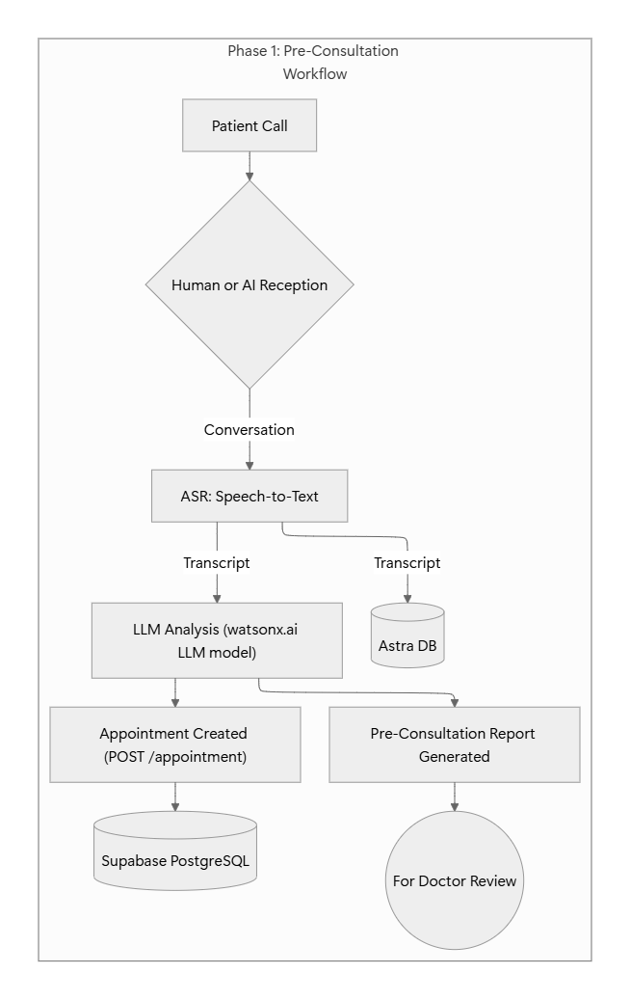
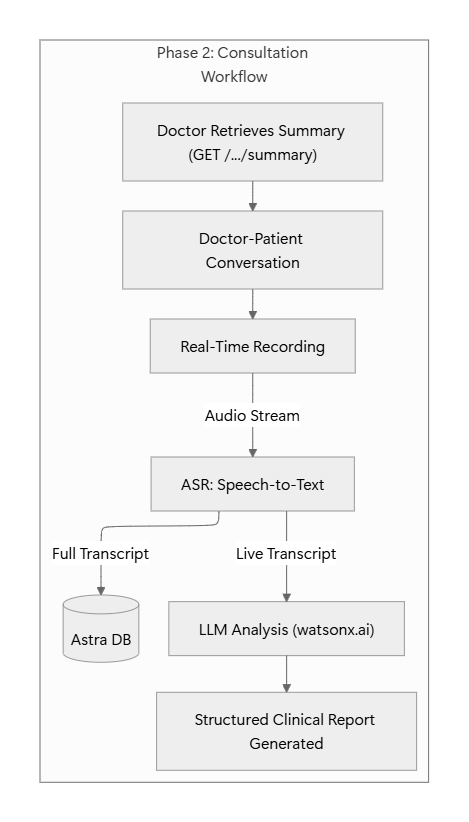
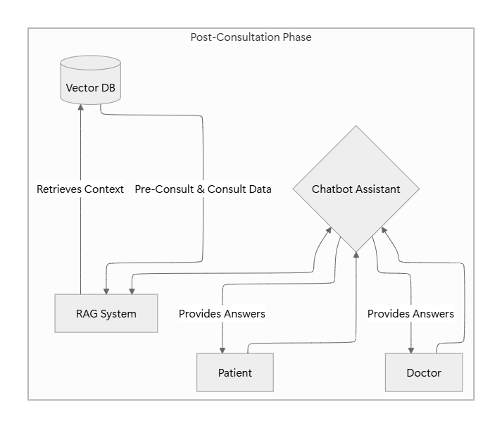

# Documentation: HealerAI

## Overview

We propose an AI-powered assistant to transform the healthcare patient journey in India. The process of booking appointments, sharing patient history, and handling follow-ups can be streamlined, reducing friction for both patients and doctors. Our solution is two-part: a pre-consultation voice agent for efficient patient intake, and a post-consultation assistant that logs and summarizes conversations, empowering both sides with instant, reliable information.

## Pain Points

The healthcare journey in India continues to face several challenges.

- Patients frequently forget crucial details about symptoms and medical history during visits, leading to incomplete information for diagnosis.
- Doctors spend significant time on manual documentation, which reduces direct patient engagement and contributes to burnout.
- After consultations, patients often seek answers online, increasing the risk of misinformation and anxiety.
- Retrieving and referencing past records is inefficient, delaying continuity of care.

These issues create inefficiencies for doctors, confusion for patients, and ultimately impact healthcare outcomes.

## Proposed Solution

HealerAI introduces a three-phase workflow for improved clinical efficiency. First, in the Pre-Consultation stage, we transcribe initial patient calls to auto-schedule appointments and generate a preliminary report for the doctor. Second, during the Consultation, our platform records and transcribes the live dialogue, using AI to create structured clinical notes instantly while saving the conversation to a vector database. Finally, in the Post-Consultation phase, this data powers a Retrieval-Augmented Generation (RAG) chatbot. This allows doctors to instantly recall case details and enables patients to receive personalized, accurate answers to their follow-up questions, creating a seamless loop of information that reduces workload and enhances patient care.

**Phase 1: Pre-Consultation Workflow**

**Phase 2: Consultation Workflow**

**Phase 3: Post-Consultation Workflow**

## Technology Stack

- Langflow: Main driver for agentic flow
- Supabase: PostgreSQL database, Serverless edge function (for API calls)
- Python notebook: for API testing and calls
- AstraDB: for vector database
- LLMs: Watsonx (for generating texts and reports), Gemini (for agent in RAG)

### AI Models and Agents

| Model Name                | Purpose                                                                                                                   | Model Type |
| ------------------------- | ------------------------------------------------------------------------------------------------------------------------- | ---------- |
| gemini-2.5-pro            | Orchestrate appointments and generate JSON data from inputs                                                               | LLM        |
| x-ai/grok-4-fast:free     | Generate patient-receptionist conversation transcripts, simulate doctor-patient consultations, and create medical reports | LLM        |
| models/text-embedding-004 | Generate embeddings for vectorizing conversation transcripts using cosine similarity                                      | Embedding  |

## Project Structure

- `src/main.ipynb`: Jupyter notebook for API testing and development.
- `src/servless/index.ts`: Serverless edge function for API endpoints.
- `src/schema.sql`: Database schema for appointments table.
- `src/workflow/workflow.json`: Langflow workflow file for the agentic AI pipeline.
- `prompts/`: Folder containing prompt files (prompt1.txt to prompt5.txt) for agent configurations.
- `Docs.md`: This documentation file.

## Prompts

1. [Patient-Receptionist conversation generator agent](prompts/prompt1.txt)
2. [Appointment Generator Agent](prompts/prompt2.txt)
3. [Doctor-Patient Generator Agent](prompts/prompt3.txt)
4. [Medical Report Generator Agent](prompts/prompt4.txt)
5. [RAG Agent Prompt](prompts/prompt5.txt)

## Future Scope

- **Frontend Integration**: Build web/mobile UI for doctors, patients, and admins to access dashboards, reports, and chatbots, evolving from headless backend to full SaaS.
- **Voice Agent Automation**: Add Retell or Eleven Labs for automated patient intake calls, enabling 24/7 scheduling and reducing receptionist workload.
- **Advanced Transcription**: Use IBM Watson or Google Speech-to-Text for real-time consultation audio transcription and AI summarization.
- **SaaS Enhancements**: Implement user auth, multi-tenancy, billing, and HIPAA-compliant security for scalable clinic deployments.
