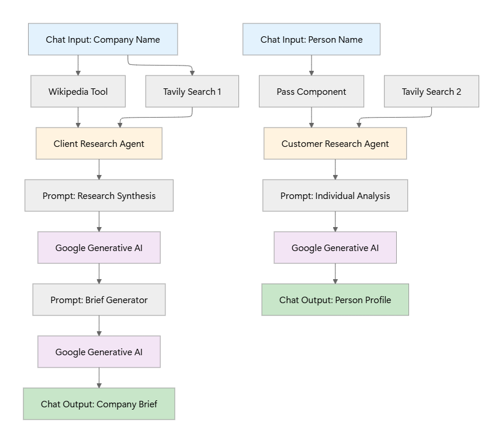

# Sales Rep Intelligence Agent

## Overview

An AI-powered sales research system that automates pre-meeting intelligence gathering for B2B sales teams. The system provides comprehensive company analysis and individual prospect research, delivering actionable insights that help sales representatives prepare for meetings, identify pain points, and develop targeted engagement strategies.

## Try It Now

**Interactive Playground**: [Live Demo](https://astra.datastax.com/langflow/92e5633d-1883-4343-b110-cf3dcdcc9daa/playground/1cb54596-b130-4f70-89a2-7666514c8789)

## Prerequisites

Before setting up the workflow, ensure you have the following API keys:

- **GEMINI_API_KEY**: Google Gemini API for AI analysis and report generation
- **TAVILY_API_KEY**: Tavily Search API for web intelligence gathering
- **ASTRA_DB_APPLICATION_TOKEN**: DataStax Astra DB token (for cloud deployment)

## Setup

1. **Access DataStax Langflow**:

   - Log in to the [Langflow dashboard](https://astra.datastax.com/langflow) on DataStax

2. **Import Workflow**:

   - Import the workflow file: `workflow.json`

3. **Configure API Keys**:

   - Navigate to **Settings** > **Global Variables**
   - Add the required API keys:
     - `GEMINI_API_KEY`
     - `TAVILY_API_KEY`
     - `ASTRA_DB_APPLICATION_TOKEN`

4. **Deploy & Run**:
   - Save your configuration
   - You're ready to run the agentic workflow!

## Architecture

## Models & Tools

| Component           | Technology                     | Purpose                                    |
| ------------------- | ------------------------------ | ------------------------------------------ |
| **LLM**             | Google Gemini (gemini-1.5-pro) | Analysis, synthesis, and report generation |
| **Web Search**      | Tavily Search API              | Real-time business intelligence gathering  |
| **Knowledge Base**  | Wikipedia API                  | Company background and historical data     |
| **Workflow Engine** | Langflow                       | Visual agent orchestration and deployment  |
| **Cloud Platform**  | DataStax Astra                 | Scalable cloud infrastructure              |

## Prompts

### Company Research Agents

1. [Agent Instructions](prompts/agent_instruct.txt) - JSON-structured instructions defining the sales intelligence agent's role, tools, search sequence, and output requirements
2. [Research Synthesis Template](prompts/research_llm_input.txt) - Template for transforming raw research data into structured one-page sales intelligence briefs
3. [Sales Intelligence Analyst System Prompt](prompts/research_llm_system.txt) - System prompt for the AI analyst specializing in creating actionable B2B sales briefings

### Customer Agent

1. [Customer Agent Instructions](prompts/customer_agent_intruct.txt) - JSON-structured instructions for the individual intelligence researcher specializing in person-specific research
2. [Customer Research Template](prompts/customer_agent_input.txt) - Template for gathering comprehensive professional background and contact intelligence for sales engagement
